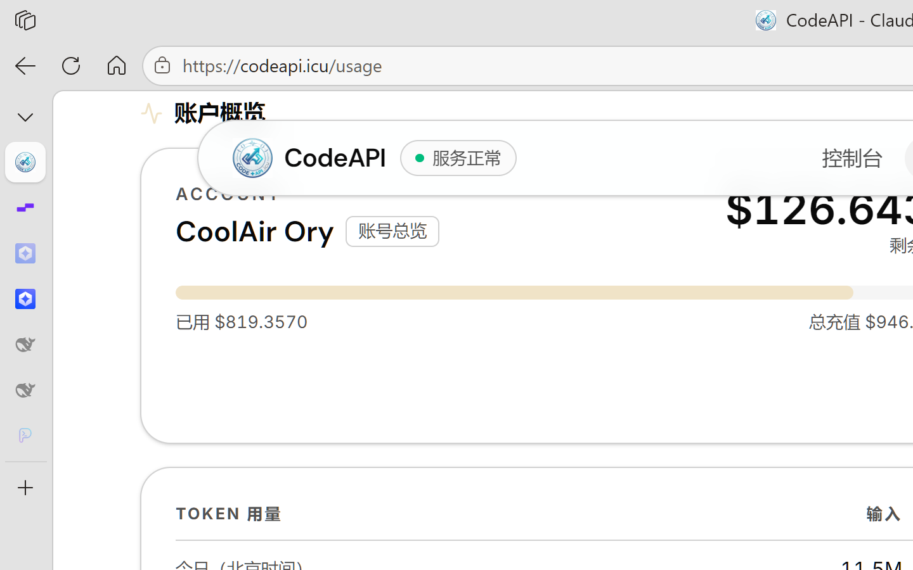

# AgentBattery

<p align="center">
  
</p>

<p align="center">
  面向 Windows 的多服务商 AI 账户看板。把余额、今日用量、本月用量和连接状态集中到一个桌面窗口里。
</p>

<p align="center">
  <a href="https://github.com/Bonjour-1/AgentBattery/releases/latest"></a>
  <a href="https://github.com/Bonjour-1/AgentBattery/actions/workflows/publish-windows-release.yml"></a>
  
  
</p>

## 主要功能

- 在一个看板中查看多个服务商的余额、今日用量和本月用量
- 手动刷新，或按自定义间隔自动刷新
- 添加、编辑、启用、排序、导入和删除 OpenAI 兼容服务商
- 通用网页账单：支持 GET / POST、请求模板、安全变量、JSON 路径和数据处理表达式
- 浏览器 cURL 导入：从真实网页请求生成账单配置
- Agent 辅助接入：调查接口、生成 handoff、校验并直接导入 AgentBattery
- 认证自动恢复：可配置 `401 / 403 → 刷新凭据 → 安全写回 → 重试一次`
- Windows 安全存储：API Key、Cookie、Token 不写入普通配置 JSON
- 内置主题、自定义主题工作台、背景、渐变、液态玻璃卡片和主题包
- Windows 托盘、全局窗口快捷键与多种窗口布局

## 下载

前往 [Releases](https://github.com/Bonjour-1/AgentBattery/releases/latest) 下载最新的 Windows x64 ZIP，解压后运行 `AgentBattery.exe`。

当前版本的 ZIP 同时附带：

```text
AGENT_SETUP.md
通用网页账单配置说明.md
schemas/provider-billing-agent-handoff.schema.json
examples/agent-handoff.example.json
examples/pucoding-agent-handoff.json
```

> AgentBattery 是便携式应用。请保留 ZIP 内的 DLL、`data` 目录和其他运行文件，不要只复制 EXE。

## 快速开始

1. 启动 `AgentBattery.exe`。
2. 打开「管理服务商」。
3. 添加服务商，填写名称、Base URL 和 API Key。
4. 保存并返回主页，点击刷新。
5. 如需定时更新，在设置中启用自动刷新并选择间隔。

如果供应商只能从网页控制台读取余额或用量，请先阅读 [通用网页账单配置说明](docs/通用网页账单配置说明.md)。

## 让 Agent 帮你接入供应商

[AGENT_SETUP.md](AGENT_SETUP.md) 是给本机 Agent 阅读的接入说明。Agent 可以调查供应商接口、生成不含 Secret 的 handoff，并在确认 AgentBattery 已关闭后直接写入配置和 Windows 安全存储。

```powershell
.\AgentBattery.exe import-agent-handoff path\to\handoff.json
```

凭据通过隐藏输入提供，不应出现在 handoff JSON、命令参数、聊天记录或普通日志中。

如果供应商提供经过验证的刷新接口，handoff 还可以描述通用认证恢复流程。AgentBattery 会在认证失败后刷新凭据、原子更新安全变量，并只重试原请求一次；多个并发失败会共享同一次刷新。

## 文档

- [通用网页账单配置说明](docs/通用网页账单配置说明.md)：请求模板、cURL 导入、安全变量、数据处理和排错
- [给 Agent 的网页账单接入说明](AGENT_SETUP.md)：Agent 调查、handoff 校验、直接导入、凭据续期与任务留存
- [handoff JSON Schema](schemas/provider-billing-agent-handoff.schema.json)：Agent 交接文件的机器可读约束
- [通用 handoff 示例](examples/agent-handoff.example.json)
- [PuCoding handoff 示例](pucoding-agent-handoff.json)：包含 Dashboard JWT 与 Refresh Token 自动续期配置

## 安全边界

- API Key、Cookie、Bearer Token 和 Refresh Token 保存在 Windows 安全存储中。
- 不要把真实凭据提交到 Git、Issue、handoff JSON、截图或聊天中。
- 从浏览器复制的完整 cURL 可能包含凭据；导入后请清理剪贴板和临时文件。
- 只有供应商提供公开、合法并经过验证的刷新协议时，才应启用认证自动续期。
- Agent 导入前必须确认 AgentBattery 已完全关闭；应用运行时导入器会拒绝写入。

## 本地开发

要求：Windows、Flutter stable，以及 Dart SDK `^3.12.2`。

```powershell
flutter pub get
flutter run -d windows
```

测试、静态分析和 Release 构建：

```powershell
flutter test
flutter analyze
flutter build windows --release
```

构建结果位于：

```text
build\windows\x64\runner\Release\
```

## 项目结构

```text
lib/
  models/       数据模型与通用网页账单配置
  services/     网络请求、安全存储、导入器与主题服务
  state/        应用状态、用量统计与自动刷新
  ui/           页面、组件、主题与窗口布局

test/           单元测试与 Widget 测试
docs/           使用说明与设计文档
schemas/        Agent handoff JSON Schema
examples/       不含真实凭据的 handoff 示例
```

## Release

Windows Release 由 [GitHub Actions](https://github.com/Bonjour-1/AgentBattery/actions/workflows/publish-windows-release.yml) 从已经合并到 `main` 的 `v*` 标签构建。Workflow 会运行测试、构建完整 Windows 应用、校验配套文档并发布 ZIP。

## 许可证

仓库当前未声明开源许可证。除非另有明确授权，保留所有权利。
